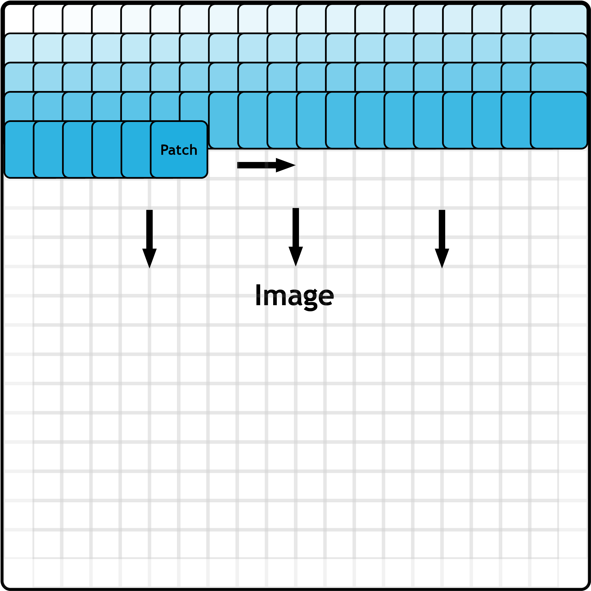
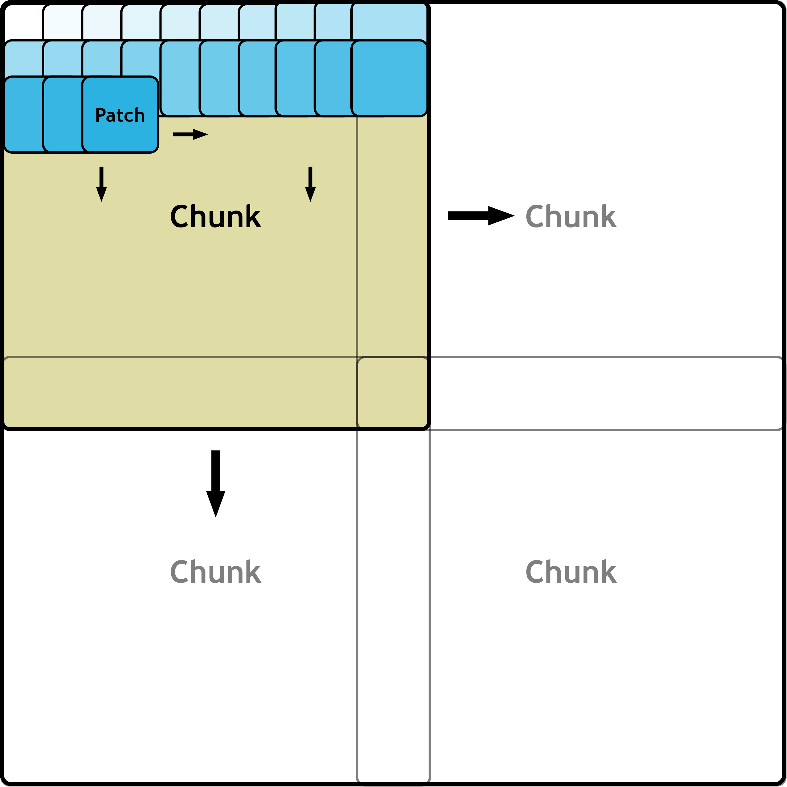

# Overview

Patchly is a grid sampler for N-dimensional images enabling inference and other processing steps on extremely large images. Especially for 3D images, it has been proven successfully to inference large images patch-wise in a sliding-window approach. Patchly does just that with a very simple interface to sample and aggregate images.

The main functionalities of Patchly consist of a Sampler, which samples patches from an image based on a grid, and an Aggregator, which assembles the patches back into the shape of the original image. There is a multitude of libraries providing similar functionality already. However, they tend to work only for a limited number of usage scenarios before becoming unusable. 

Patchly is the first library providing an advanced set of features for users working with sophisticated image processing pipelines requiring patch-based processing.

## Feature summary

Patchly provides the following advanced features:
- N-dimensional image handling (1D, 2D, 3D, ...)
- Multiple border-handling strategies
- Support for any array-like images (Numpy, Tensor, Zarr, Dask, ...)
- Memory-mapped image support
- Patch overlap
- ~~Numpy padding techniques~~
- Support for images with non-spatial dimensions (color dimension, batch dimension, ...)
- Chunk aggregation to minimize memory consumption

## Sampler

  
  

    The Sampler samples patches from the image in a grid-like manner as depicted in the left Figure. Patches are exhaustively and deterministically sampled from the top left to the bottom right on-the-fly via a generator. Each patch is provided to the user together with its respective patch location.
  

## Aggregator

  
  

    The Aggregator assembles the patches back into its original image shape and works in the same manner as the Sampler. Patches are exhaustively and deterministically aggregated from the top left to the bottom right on-the-fly given the patch location of the respective patch.
  

## Features

### N-dimensional image handling

Patchly is capable of handling images with arbitrary spatial image dimensions (1D, 2D, 3D, ...). No additiional setup is required and the image can simply be passed to the Sampler as an N-dimensional array.

### Border-handling strategies

Patchly supports multiple border handling strategies in case the chosen patch size or step size would otherwise lead to patches extending over the image borders.

In the following the different modes are explained for the 1D case with the last patch extending over the right image border:

**Squeeze sampling (Default):** The step size is reduced resulting in a slightly increased patch overlap such that the last patch still fits into the image. The patch size remains unchanged, while the position and step size is changed slightly for each patch. This can intuitively be viewed as all patches being squeezed together and is the best for most scenarios, escpecially deep learning pipelines.

**Edge sampling:** All patches remain unchanged except for the last patch, which is moved to fit into the image such that it is alinged with the right border of the image. The patch position, size and step size remains unchaged for all patches, except for the last patch for which the position and step size is changed slightly.

**Adaptive sampling:** All patches remain unchanged except for the last patch, for which the patch size is reduced such that it still fits into the image. This mode is not recommended for deep learning pipelines as a unconventional patch size can lead to errors when processed by neural networks.

**Crop sampling:** All patches remain unchanged except for the last patch which is discarded. The image can still be assembled with the Aggregator, but the values for the missing patch will be zero.

### Array-like images

By default, Patchly accepts images for a multitude of array-like formats such as Numpy, Tensor, Zarr and Dask. Further, array-like formats can be implemented via the ArrayLike wrapper.

### Memory-mapped image support

Patchly supports memory-mapped arrays. Memory-mapped arrays are arrays handled within the code as though they are fully loaded into memory, when in fact, only the portions being accessed are loaded at any given time. Patchly is designed such that only the current patch is loaded and never the entire image, if the image is provided as a memory-mapped array.

### Patch overlap

Patchly supports overlapping patches with arbitrary patch overlap during sampling with the Sampler and assembly with the Aggregator. The patch overlap is defined via the step size in the Sampler.

### Non-spatial dimension support

Patchly supports arbitrary non-spatial dimensions such as color or batch dimensions. The non-spatial dimensions can be the leading or following dimensions of the spatial dimensions, which is configurable via the `spatial_first` parameter in the Sampler. When providing a batch dimension the parameter `has_batch_dim` in the Aggregator needs to be set to True for the correct handling of this dimension.

### Chunk aggregation

  
  

    There are a number of scenarios in which the processed output patches occupy a lot of memory as it is the case with 3D softmax predictions in medical deep learning pipelines during inference. In such cases the reassembled image can often require more memory than available. In order to be able to still conduct inference, Patchly supports chunk-based sampling and aggregation of images. Here, the image is virtually divided into chunks that fit into memory with Patchly sampling and aggregating patches only from a single chunk until completion before moving to the next chunk. After a chunk is completed, a user provided postprocessing function can be applied such as converting the softmax chunk into more memory-friendly class predictions.
  

